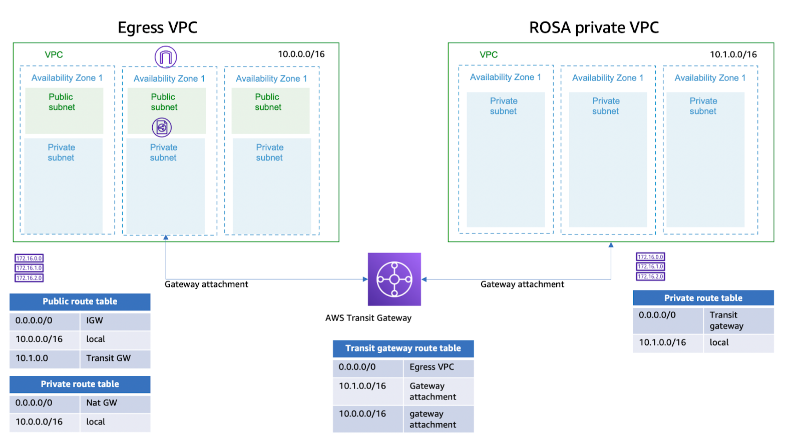

# ROSA PrivateLink

This repository provides an AWS CloudFormation template that [creates a private Red Hat on OpenShift (ROSA) cluster using AWS PrivateLink and AWS Security Token Service (STS)](https://developers.redhat.com/articles/2022/04/27/create-privatelink-red-hat-openshift-cluster-aws-sts#create_the_subnets).

---

IMPORTANT: This setup is not recommended for production as the infrastructure provisioned resides in a single AWS availability zone  

---

## Architecture Overview

This solution creates the AWS PrivateLink networking infrastructure resources required to support a private Red Hat OpenShift on AWS (ROSA) cluster.



## Deployment

The solution is deployed using a CloudFormation template.

### Pre-requisites

- [AWS CLI](https://docs.aws.amazon.com/cli/latest/userguide/getting-started-install.html)
- [ROSA CLI](https://github.com/openshift/rosa/releases)
- [jq](https://stedolan.github.io/jq/download/0)

### Step 1: AWS CloudFormation

Create the AWS CloudFormation stack with the following command:

```bash
export AWS_REGION=us-west-2
export AWS_STACK_NAME=rosa-privatelink

aws cloudformation create-stack --stack-name $AWS_STACK_NAME --template-body file://rosa-privatelink-egress-vpc.single-subnet.cfn.yml
```

To change the parameters available, add the following option to the previous command:

```bash
--parameters ParameterKey=pEnableELBServiceLinkedRole,ParameterValue=false ParameterKey=pROSAVPCSubnetCidrBlock,ParameterValue=10.1.0.0/17 ParameterKey=pROSAVPCCidrBlock,ParameterValue=10.1.0.0/16
```

See full list of parameters in [rosa-privatelink-egress-vpc.single-subnet.cfn > Parameters section](rosa-privatelink-egress-vpc.single-subnet.cfn.yml)

### Step 2: ROSA cluster first initialisation

Once step 1 is completed, the ROSA cluster can be created with the following commands:

```bash
rosa create account-roles \
    --mode auto \
    --yes
```

### Step 3: ROSA cluster installation

```bash
export ROSA_CLUSTER_NAME=rosa-privlink
export ROSA_PRIVATE_SUBNET=`aws cloudformation describe-stacks --stack-name $AWS_STACK_NAME --query "Stacks[0].Outputs[?OutputKey=='oRosaVpcSubnet'].OutputValue" --output text`
echo "ROSA private subnet: $ROSA_PRIVATE_SUBNET"

rosa create cluster \
    -y \
    --cluster-name $ROSA_CLUSTER_NAME \
    --private-link \
    --machine-cidr=10.1.0.0/16 \
    --sts \
    --version=4.9.15 \
    --subnet-ids=$ROSA_PRIVATE_SUBNET \
    --region $AWS_REGION

rosa create operator-roles --cluster $ROSA_CLUSTER_NAME
rosa create oidc-provider --cluster $ROSA_CLUSTER_NAME

VPC_EGRESS=`aws cloudformation describe-stacks --stack-name rosa-privatelink --query "Stacks[0].Outputs[?OutputKey=='oEgressVpc'].OutputValue" --output text`
echo "Egress VPC Id: $VPC_EGRESS"
DNS_DOMAIN=$(rosa describe cluster --cluster $ROSA_CLUSTER_NAME -ojson | jq -r .dns.base_domain)
echo "ROSA Cluster Domain Name: $DNS_DOMAIN"
```

Please, proceed with the following steps **during** cluster creation:

1. Find the current status of the cluster with the `rosa list cluser`.
2. If the cluster status is *installing*, run the following commands:

```bash
# The following step may fail if the cluster installation has not reached the DNS configuration stage. 
# Please repeat the command until the Route 53 Hosted Zone is found
R53HZ_ID=$(aws route53 list-hosted-zones-by-name | jq --arg name "$ROSA_CLUSTER_NAME.$DNS_DOMAIN." -r '.HostedZones | .[] | select(.Name=="\($name)") | .Id')
echo "ROSA Cluster Route 53 Hosted Zone Id: $R53HZ_ID"
aws route53 associate-vpc-with-hosted-zone --hosted-zone-id $R53HZ_ID --vpc VPCRegion=$AWS_REGION,VPCId=$VPC_EGRESS
```

### Decommissioning

Delete the ROSA cluster and CloudFormation stack by running the following commands:

```bash
rosa delete cluster -c $ROSA_CLUSTER_NAME
aws cloudformation delete-stack --stack-name $AWS_STACK_NAME
```

---

Copyright 2022 Amazon.com, Inc. or its affiliates. All Rights Reserved.

Licensed under the Apache License Version 2.0 (the "License"). You may not use this file except in compliance with the License. A copy of the License is located at <http://www.apache.org/licenses/> or in the "license" file accompanying this file. This file is distributed on an "AS IS" BASIS, WITHOUT WARRANTIES OR CONDITIONS OF ANY KIND, express or implied. See the License for the specific language governing permissions and limitations under the License.
